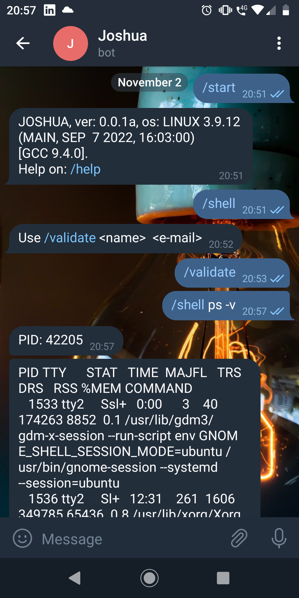

# JOSHUA  

JOSHUA is a Manager for Telegram bots written in Python.  
Receives commands via messages (bash style) to be executed by the host machine in a non-blocking manner. Only commands with STDOUT output are responded by JOSHUA via text.   

## Bot HASH
Before use you will have to create a file named 'SECRET.py'
with the 'HTTP_API'.  

```python
HTTP_API = <telegram_hash>
```  

To create your onw bot, refer to Telegram bot documentation.

## Use  
Program executes with ```python3 telegram.py```  
Once JOSHUA is running, find your bot on Telegram and execute:  
```bash
/start  
/validate
```  
Find a folder named 'mod_active'. Inisde that folder is a file with 
extention '.request'. Copy the number written in the file and execute:

```bash
python activate.py
```
paste the number and use the option 'valid'  

Now JOSHUA is ready to take your commands using:  
```bash
/shell <command>
```  
if the command isued is acepted you will get the PID number.




